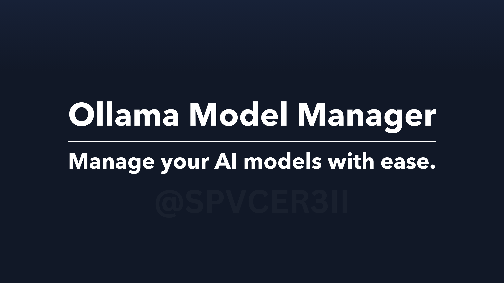

# Ollama Model Manager

---

Welcome! This is my first publicly available Vite application, and I'd just like to say right now... this took me about 44 minutes to make. Most of the time went into the UI, and the rest into actually getting the app to interact with the API.

Anyways... let's go through the features!

## Features
- Model Viewer: A clean, sleek UI to view models in. Sorry Light theme users, but this only has a dark mode...
- Model Editor: Delete, rename, and view information on models!
- Model Pulling: Pull new models, and view information on them!
- Model Searching: Search for the model you want, quickly and efficiently.

## Installation:

First, you gotta clone the repository.
> `git clone https://github.com/SpvceR3ii/OllamaMM.git`

Next, you have to install the node modules... or it wont work...
> `npm install`

And for the last step... Run it!
> `npm run dev`

## Extra Information
This application was made with limited resources at hand. Do not expect more updates to come out, other than PR's and bug hunts.

If you'd like to administer a change, feel free to make a PR.

Link to our Discord: [Discord](https://discord.gg/zBvUqbahdb)